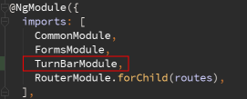
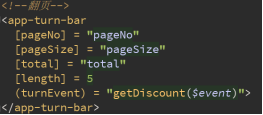
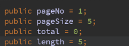
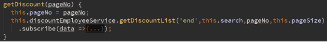

#组件名称：蓝色页码翻页组件
##组件截图： 
  
##模块名 ： TurnBarModule（使用时需要在相应模块调用）。

###@Input ：	
+ *pageNo  ： number （  当前页码  ）默认值：1  取值范围：>=1
+ pageSize ： number （页面显示条数）默认值：10 取值范围：>=1
+ *Total   ： number （总共数据条数）默认值：0  取值范围：>=0
+ Length   ： number （页码显示页数）默认值：5  取值范围：> =2
####注释：“*”标志为必填

###@Output ：
+ *	turnEvent ： EventEmitter<number>（跳转的事件及跳转页码参数）

##使用样例：

###模块内Module文件
+ Import模块
  
  
+ 在@NgModule装饰器下imports该模块。
  
  
###模块内HTML文件
  
  
###模块内component文件
+ 声明需要的值，并初始化参数。
  
  
+ 获取组件回传值，并进行初始化。
  
